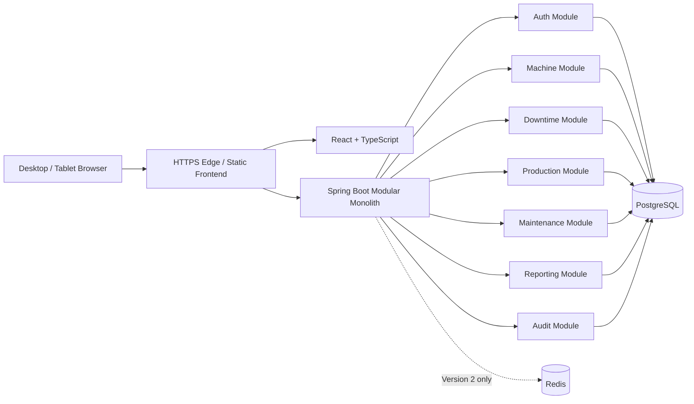

# FactoryOS Architecture

## Scope and deployment model

FactoryOS is an online-only manufacturing operations system for one organization and one plant per deployment. The MVP is a Spring Boot modular monolith with a React/TypeScript frontend and PostgreSQL. The frontend and API share an origin in production; the browser never connects directly to PostgreSQL.

The MVP deployable consists of one backend, one frontend, and one PostgreSQL instance. Redis, Kafka, MQTT, WebSockets, Kubernetes, service extraction, and offline write queues are Version 2 or Version 3 options and are not required runtime components for MVP.

## System context



## Module boundaries

The backend base package is `com.factoryos.modules.<domain>`. Every domain module uses `api`, `application`, `domain`, and `infrastructure` packages.

| Module | Owns | Public boundary |
|---|---|---|
| `auth` | Users, roles, authentication, refresh sessions, permission checks | Authentication and authorization application services |
| `machine` | Machine identity and authoritative current status | Machine registry and status application services |
| `downtime` | Downtime event persistence and local lifecycle rules | Internal event application interface |
| `production` | Production Orders and cumulative output | Order lifecycle and output services |
| `maintenance` | Maintenance work orders, assignment, and lifecycle | Work-order application services |
| `reporting` | Read-only KPI projections and aggregations | Dashboard query services |
| `audit` | Append-only actor-attributed business change records | Audit recording service; no MVP browsing API |
| `operations` | Cross-domain workflow orchestration; no tables | Coordinated machine/status, downtime, production lifecycle, assignment and account-change commands |

Controllers validate transport input and delegate to application services. Application services own transaction boundaries and return DTOs. Modules may call another module's published application interface, but must never call another module's repository or reach into its infrastructure package. Reporting may use documented read-only SQL projections across module tables. Shared infrastructure is limited to error handling, time, security context, tracing, and persistence support; it must not contain business rules.

Architecture tests enforce repository isolation and prevent dependency cycles.

The `operations` application layer owns cross-domain command transactions and their controllers, without changing the documented endpoint paths. It calls public application interfaces of machine, downtime, production, maintenance and auth. Those domain modules never call operations or one another; they enforce local rules and expose bounded query/mutation methods. Domain modules may call the audit append interface; audit never calls them. Authentication filters provide actor context without a reverse dependency on operations. Reporting remains a separate read-only projection module. In particular, machine does not query production or call downtime: operations checks the active order and coordinates status/event writes. Low-level mutation interfaces are internal to these workflows, not alternate public HTTP entry points.

Account deactivation, archive, or changing a Technician to another role is blocked with `409` while that user has nonterminal assigned work; managers must reassign or cancel that work first. Account changes and maintenance assignment lock affected user rows first (multiple users in UUID order), then the machine if needed, then work/order rows. Assignment revalidates the locked user's active, non-deleted Technician role. All last-Admin mutations additionally serialize on the seeded ADMIN role row before user locks, so simultaneous demotions cannot remove every Admin.

## Transaction and consistency rules

All business mutations run in a database transaction. A successful consequential mutation and its audit event commit atomically. If audit insertion fails, the business mutation rolls back.

Operations that involve machine state lock the machine row before the associated order, downtime event, or work order. When eligibility changes also require user locks, acquire those first under the global ordering below. Mutable business records carry a numeric `version`; APIs require `expectedVersion` for updates and return `409 VERSION_CONFLICT` when the value is stale.

PostgreSQL partial unique indexes are the final enforcement layer for one open downtime event per machine and one in-progress Production Order per machine. Application validation remains responsible for clear errors.

## Machine status

Machine status values are `IDLE`, `RUNNING`, and `DOWN`.

- A new machine starts in `IDLE`.
- `IDLE ↔ RUNNING` is permitted by the transition rules.
- Entering `RUNNING` requires an active `IN_PROGRESS` Production Order.
- Entering `DOWN` requires a reason and opens one downtime event in the same transaction.
- Leaving `DOWN` is permitted only through downtime resolution.
- Completing or cancelling the active order changes `RUNNING` to `IDLE`.
- Completing or cancelling an order does not change a machine already in `DOWN`; downtime remains open until explicitly resolved.

The machine status API and downtime-create API use the same operations transition coordinator. This prevents one entry point from creating a status/event mismatch.

## Downtime lifecycle

An unresolved downtime event is identified by `end_time IS NULL`. A machine can have at most one such event. MVP records server-time operational events; historical intervals cannot be backdated or edited through the API.

Creating downtime requires a reason and locks the machine. Resolution requires a nonblank resolution note, closes the event, records the resolver, and sets the machine to `IDLE` in the same transaction. Repeated create or resolve requests return a conflict rather than creating duplicate state.

Completing a linked maintenance work order never resolves downtime implicitly.

## Production Order lifecycle

```text
DRAFT -> RELEASED -> IN_PROGRESS -> COMPLETED
  |         |            |             terminal
  +---------+------------+-----------> CANCELLED (terminal)
```

`DRAFT`, `RELEASED`, and `IN_PROGRESS` may become `CANCELLED`. Only `DRAFT` permits machine, product, and planned-quantity changes. Terminal orders are immutable.

- Starting requires the machine to be `IDLE` and sets it to `RUNNING`.
- At most one `IN_PROGRESS` order exists per machine.
- Downtime leaves the order `IN_PROGRESS` so production can resume later.
- Good and scrap values are cumulative non-negative integers. An output update replaces both totals and requires the order version; it does not silently increment them.
- Output corrections while `IN_PROGRESS` are audited.
- Completion requires positive total output (`good_quantity + scrap_quantity > 0`). Completing below planned quantity requires a closure note.
- Counts may exceed planned quantity.
- Completing or cancelling an active order changes a `RUNNING` machine to `IDLE` only when the machine is not `DOWN`.

## Maintenance lifecycle

```text
OPEN -> ASSIGNED -> IN_PROGRESS -> COMPLETED (terminal)
  +-----------------------------------------> CANCELLED (terminal)
```

Any nonterminal state may be cancelled by an authorized manager. Assignees must be active Technicians. Reassignment during work preserves `IN_PROGRESS`. Completion requires a completion note. Terminal work orders are immutable. Maintenance state does not implicitly change machine state.

Assigning an `OPEN` work order automatically changes it to `ASSIGNED`. In `ASSIGNED`, clearing `assignedTo` returns it to `OPEN`; in `IN_PROGRESS`, clearing is rejected but reassignment to another eligible Technician is allowed. `ASSIGNED`, `IN_PROGRESS`, and `COMPLETED` require a non-null assignee. A PATCH may assign and start together if both transitions are valid. Reject explicit status values that contradict the resulting assignment, backward lifecycle transitions, and attempts to skip `IN_PROGRESS` when completing.

Technicians may update lifecycle and completion fields only on work orders assigned to themselves. Production Managers, Engineers, and Admins may plan, assign, reassign, and perform permitted lifecycle actions. Operators can create requests but cannot update them after creation.

## API and error contract

The API is versioned under `/api/v1`. Controllers return DTOs and never expose JPA entities. Shared response rules are defined in `API-DESIGN.md`.

- `400`: malformed input or validation failure.
- `401`: missing or invalid authentication.
- `403`: authenticated but forbidden.
- `404`: resource does not exist or is unavailable to the caller.
- `409`: stale version, uniqueness conflict, or invalid state transition.
- `429`: rate limit exceeded.

Mutation requests use explicit allowed fields and reject unknown fields. List endpoints use server-side pagination, approved filters, and allowlisted sort fields. All timestamps are UTC ISO 8601 values; plant-local rendering uses the configured IANA timezone.

## Reporting and KPI boundaries

The dashboard is read-only and available to every authenticated role. It returns a snapshot timestamp (`asOf`) and a required half-open range `[from,to)`, with a maximum range of 90 days.

- Machine counts are current non-archived machines grouped by reported status.
- Downtime is the sum of event overlap with the selected range. Open events are clipped at `min(asOf,to)`.
- Maintenance backlog counts current nonterminal work orders by status and priority; overdue means `due_at < asOf`.
- Completed production counts orders completed in the range and their final good/scrap totals. Output is attributed to completion time, not per-unit production time.
- Current-state cards are labeled `Current`; interval metrics show the selected range.
- Historical interval totals retain records for subsequently archived machines.

OEE, utilization, shift-level output, inventory, quality inspection, and per-unit production timing are outside MVP. Basic machine uptime must not be presented as OEE.

## Observability

Spring Boot Actuator provides `/actuator/health` and `/actuator/metrics`. Liveness describes process health. Readiness includes database availability. Detailed metrics and health details are restricted to the internal management network; public health responses disclose no database or configuration details.

Structured JSON logs include timestamp, severity, service, environment, trace ID, request ID, authenticated user ID, event, and outcome. Logs must never contain passwords, JWTs, cookies, authorization headers, or complete request bodies. Request IDs are bounded and validated, and trace IDs propagate through the request.

Expose metrics for HTTP duration and errors, connection-pool saturation, JVM health, authentication failures, and optimistic-lock conflicts. Retain application logs for 30 days and essential audit records for at least one year.

Alert on readiness failure for two minutes, HTTP 5xx above 2% for five minutes, API p95 above 500 ms for ten minutes, database disk usage above 80%, or a failed/missing recent backup or WAL archive.

## Reliability and operations

The monthly availability objective is 99.5%, excluding announced maintenance. Backups target RPO ≤15 minutes and RTO ≤4 hours, and restoration drills must validate both objectives. Database and management ports are private. Production startup fails when required secrets are missing or insecure defaults remain.

Schema changes use Flyway. The migration-only backend image runs Flyway and exits; the runtime backend image validates the already-migrated schema and never runs migrations or creates production tables. Additive, backward-compatible migrations are required for normal releases; destructive schema recovery requires a separate restoration decision.
