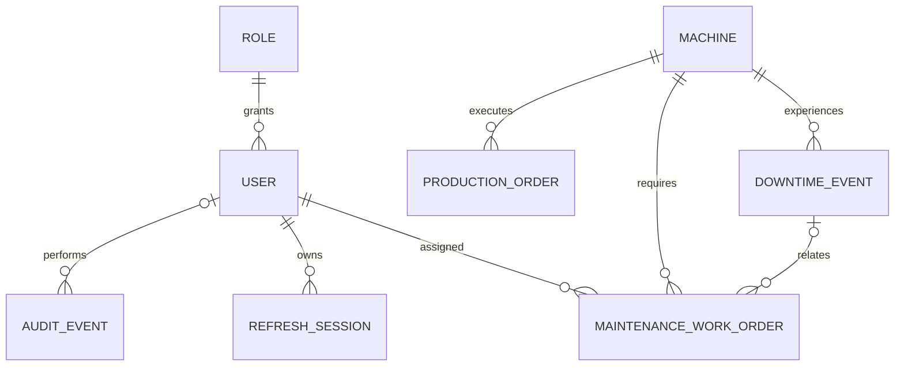

# FactoryOS Data Design

## Database conventions

- PostgreSQL identifiers use `snake_case`; API and domain identifiers use the names `User`, `Role`, `Machine`, `DowntimeEvent`, `ProductionOrder`, and `MaintenanceWorkOrder`.
- All identifiers are UUID v4 values generated by the application or database UUID support.
- All timestamps are `timestamptz` and stored in UTC.
- Unless a table is explicitly described as append-only, every table includes `created_at timestamptz NOT NULL`, `updated_at timestamptz NOT NULL`, `created_by uuid NULL`, `updated_by uuid NULL`, `is_deleted boolean NOT NULL DEFAULT false`, and `version bigint NOT NULL DEFAULT 0 CHECK (version >= 0)`. Append-only audit records omit business soft-deletion/version fields; security-session rows retain them as inert retention markers.
- `created_by` and `updated_by` reference `users.id` with `ON DELETE RESTRICT`; they are nullable for deployment bootstrap or system-created records.
- Foreign keys use `ON DELETE RESTRICT` unless a different rule is explicitly listed. Operational history is never deleted through a cascading relationship.
- Enumerations are stored as uppercase `varchar` or `text` values with database `CHECK` constraints. Application enums and database checks must be updated together through a versioned Flyway migration.
- String values are trimmed at the API boundary. Email uniqueness is case-insensitive. Machine serial numbers are stored trimmed and uppercase.
- Business records use optimistic locking through `version`. A mutation supplies `expectedVersion`; a stale value affects zero rows and returns `409 VERSION_CONFLICT`.

## Tables and columns

The following definitions specify the logical schema. Exact varchar lengths are part of the contract and may be tightened only through a reviewed migration.

### `roles`

| Column | Type | Nullability / default | Rules |
|---|---|---|---|
| `id` | `uuid` | `NOT NULL` | Primary key |
| `name` | `varchar(32)` | `NOT NULL` | Unique; `ADMIN`, `PRODUCTION_MANAGER`, `ENGINEER`, `TECHNICIAN`, `OPERATOR`, or `VIEWER` |
| `created_at` | `timestamptz` | `NOT NULL DEFAULT now()` | Creation time |
| `updated_at` | `timestamptz` | `NOT NULL DEFAULT now()` | Seed records are immutable |
| `created_by` | `uuid` | `NULL` | FK to `users.id`, `ON DELETE RESTRICT`; null for seed/bootstrap |
| `updated_by` | `uuid` | `NULL` | FK to `users.id`, `ON DELETE RESTRICT` |
| `is_deleted` | `boolean` | `NOT NULL DEFAULT false` | Always false in MVP |
| `version` | `bigint` | `NOT NULL DEFAULT 0` | Always zero while roles are immutable |

Roles are seeded and cannot be archived or renamed in MVP.

### `users`

| Column | Type | Nullability / default | Rules |
|---|---|---|---|
| `id` | `uuid` | `NOT NULL` | Primary key |
| `email` | `varchar(320)` | `NOT NULL` | Store normalized form; unique index on `lower(trim(email))` |
| `display_name` | `varchar(120)` | `NOT NULL` | Nonblank |
| `password_hash` | `varchar(255)` | `NOT NULL` | BCrypt; never returned or logged |
| `role_id` | `uuid` | `NOT NULL` | FK to `roles.id`, `ON DELETE RESTRICT` |
| `is_active` | `boolean` | `NOT NULL DEFAULT true` | Inactive users cannot authenticate |
| `must_change_password` | `boolean` | `NOT NULL DEFAULT false` | Temporary-password gate |
| `created_at` | `timestamptz` | `NOT NULL DEFAULT now()` | Common metadata |
| `updated_at` | `timestamptz` | `NOT NULL DEFAULT now()` | Common metadata |
| `created_by` | `uuid` | `NULL` | FK to `users.id`, `ON DELETE RESTRICT` |
| `updated_by` | `uuid` | `NULL` | FK to `users.id`, `ON DELETE RESTRICT` |
| `is_deleted` | `boolean` | `NOT NULL DEFAULT false` | Archive marker; archive also sets `is_active=false` |
| `version` | `bigint` | `NOT NULL DEFAULT 0` | Optimistic version |

The final active Admin cannot be deactivated, demoted, or archived. No business hard-delete API exists.

### `machines`

| Column | Type | Nullability / default | Rules |
|---|---|---|---|
| `id` | `uuid` | `NOT NULL` | Primary key |
| `serial_number` | `varchar(80)` | `NOT NULL` | Stored as `upper(trim(...))`; unique, including archived machines |
| `name` | `varchar(120)` | `NOT NULL` | Nonblank |
| `location` | `varchar(160)` | `NOT NULL` | Plant-local location |
| `description` | `varchar(2000)` | `NULL` | Plain text |
| `status` | `varchar(16)` | `NOT NULL DEFAULT 'IDLE'` | `IDLE`, `RUNNING`, or `DOWN` |
| `created_at` | `timestamptz` | `NOT NULL DEFAULT now()` | Common metadata |
| `updated_at` | `timestamptz` | `NOT NULL DEFAULT now()` | Common metadata |
| `created_by` | `uuid` | `NULL` | FK to `users.id`, `ON DELETE RESTRICT` |
| `updated_by` | `uuid` | `NULL` | FK to `users.id`, `ON DELETE RESTRICT` |
| `is_deleted` | `boolean` | `NOT NULL DEFAULT false` | Archive marker |
| `version` | `bigint` | `NOT NULL DEFAULT 0` | Optimistic version |

Archive is blocked while the machine has open downtime, nonterminal maintenance, or nonterminal Production Orders. Historical reads retain archived machine references.

### `production_orders`

| Column | Type | Nullability / default | Rules |
|---|---|---|---|
| `id` | `uuid` | `NOT NULL` | Primary key |
| `order_number` | `varchar(40)` | `NOT NULL` | Generated unique business number; sequence gaps are allowed |
| `machine_id` | `uuid` | `NOT NULL` | FK to `machines.id`, `ON DELETE RESTRICT` |
| `product_code` | `varchar(100)` | `NOT NULL` | Editable only in `DRAFT` |
| `product_description` | `varchar(500)` | `NULL` | Plain text; editable only in `DRAFT` |
| `planned_quantity` | `integer` | `NOT NULL` | `CHECK (planned_quantity > 0)` |
| `good_quantity` | `integer` | `NOT NULL DEFAULT 0` | `CHECK (good_quantity >= 0)` |
| `scrap_quantity` | `integer` | `NOT NULL DEFAULT 0` | `CHECK (scrap_quantity >= 0)` |
| `status` | `varchar(16)` | `NOT NULL DEFAULT 'DRAFT'` | `DRAFT`, `RELEASED`, `IN_PROGRESS`, `COMPLETED`, or `CANCELLED` |
| `started_at` | `timestamptz` | `NULL` | Set when first started |
| `completed_at` | `timestamptz` | `NULL` | Set for `COMPLETED` |
| `closed_at` | `timestamptz` | `NULL` | Set for terminal status |
| `closure_note` | `varchar(2000)` | `NULL` | Required for early completion and cancellation |
| `created_at` | `timestamptz` | `NOT NULL DEFAULT now()` | Common metadata |
| `updated_at` | `timestamptz` | `NOT NULL DEFAULT now()` | Common metadata |
| `created_by` | `uuid` | `NULL` | FK to `users.id`, `ON DELETE RESTRICT` |
| `updated_by` | `uuid` | `NULL` | FK to `users.id`, `ON DELETE RESTRICT` |
| `is_deleted` | `boolean` | `NOT NULL DEFAULT false` | Remains false; business closure uses status |
| `version` | `bigint` | `NOT NULL DEFAULT 0` | Optimistic version |

The database requires non-negative quantities. Application transition logic requires positive total output on completion, requires a closure note when completion is below planned quantity, and makes terminal rows immutable. An order's machine cannot be changed after it leaves `DRAFT`.

### `downtime_events`

| Column | Type | Nullability / default | Rules |
|---|---|---|---|
| `id` | `uuid` | `NOT NULL` | Primary key |
| `machine_id` | `uuid` | `NOT NULL` | FK to `machines.id`, `ON DELETE RESTRICT` |
| `reason_code` | `varchar(32)` | `NOT NULL` | `BREAKDOWN`, `SETUP`, `MATERIAL_SHORTAGE`, or `OTHER` |
| `description` | `varchar(2000)` | `NULL` | Plain text |
| `start_time` | `timestamptz` | `NOT NULL` | Server time; MVP does not backdate |
| `end_time` | `timestamptz` | `NULL` | `CHECK (end_time IS NULL OR end_time >= start_time)` |
| `resolution_note` | `varchar(2000)` | `NULL` | Required when resolved; nonblank after trim |
| `resolved_by` | `uuid` | `NULL` | FK to `users.id`, `ON DELETE RESTRICT`; required when resolved |
| `created_at` | `timestamptz` | `NOT NULL DEFAULT now()` | Common metadata |
| `updated_at` | `timestamptz` | `NOT NULL DEFAULT now()` | Common metadata |
| `created_by` | `uuid` | `NULL` | FK to `users.id`, `ON DELETE RESTRICT` |
| `updated_by` | `uuid` | `NULL` | FK to `users.id`, `ON DELETE RESTRICT` |
| `is_deleted` | `boolean` | `NOT NULL DEFAULT false` | Remains false; resolution closes the event |
| `version` | `bigint` | `NOT NULL DEFAULT 0` | Optimistic version |

Add `UNIQUE (id, machine_id)` to support the maintenance composite foreign key. Add a partial unique index on `machine_id WHERE end_time IS NULL` so a machine has at most one open event. A resolved event must have both `end_time` and `resolved_by`; an open event must have neither. Resolution is performed by the application transaction that sets the machine to `IDLE`.

### `maintenance_work_orders`

| Column | Type | Nullability / default | Rules |
|---|---|---|---|
| `id` | `uuid` | `NOT NULL` | Primary key |
| `work_order_number` | `varchar(40)` | `NOT NULL` | Generated unique business number; sequence gaps are allowed |
| `machine_id` | `uuid` | `NOT NULL` | FK to `machines.id`, `ON DELETE RESTRICT` |
| `downtime_event_id` | `uuid` | `NULL` | Composite FK `(downtime_event_id, machine_id)` to `downtime_events(id, machine_id)` |
| `title` | `varchar(160)` | `NOT NULL` | Nonblank |
| `description` | `varchar(4000)` | `NOT NULL` | Plain text, nonblank |
| `priority` | `varchar(16)` | `NOT NULL DEFAULT 'MEDIUM'` | `LOW`, `MEDIUM`, `HIGH`, or `CRITICAL` |
| `status` | `varchar(16)` | `NOT NULL DEFAULT 'OPEN'` | `OPEN`, `ASSIGNED`, `IN_PROGRESS`, `COMPLETED`, or `CANCELLED` |
| `assigned_to` | `uuid` | `NULL` | FK to `users.id`, `ON DELETE RESTRICT`; application requires active Technician |
| `due_at` | `timestamptz` | `NULL` | Optional due time |
| `started_at` | `timestamptz` | `NULL` | Set when work begins |
| `completed_at` | `timestamptz` | `NULL` | Set for `COMPLETED` |
| `closed_at` | `timestamptz` | `NULL` | Set for terminal status |
| `completion_note` | `varchar(4000)` | `NULL` | Required for `COMPLETED` |
| `cancellation_note` | `varchar(2000)` | `NULL` | Required for `CANCELLED` |
| `created_at` | `timestamptz` | `NOT NULL DEFAULT now()` | Common metadata |
| `updated_at` | `timestamptz` | `NOT NULL DEFAULT now()` | Common metadata |
| `created_by` | `uuid` | `NULL` | FK to `users.id`, `ON DELETE RESTRICT` |
| `updated_by` | `uuid` | `NULL` | FK to `users.id`, `ON DELETE RESTRICT` |
| `is_deleted` | `boolean` | `NOT NULL DEFAULT false` | Remains false; closure uses status |
| `version` | `bigint` | `NOT NULL DEFAULT 0` | Optimistic version |

The composite FK guarantees that a linked downtime event belongs to the same machine. Application services enforce that only active Technicians can be assigned and that terminal rows are immutable. Maintenance completion never updates downtime or machine status.

### `refresh_sessions`

Refresh sessions are security records and are not soft-deletable business entities. They remain queryable for replay evidence until retention cleanup.

| Column | Type | Nullability / default | Rules |
|---|---|---|---|
| `id` | `uuid` | `NOT NULL` | Primary key |
| `user_id` | `uuid` | `NOT NULL` | FK to `users.id`, `ON DELETE RESTRICT` |
| `family_id` | `uuid` | `NOT NULL` | Groups rotated credentials |
| `token_hash` | `char(64)` | `NOT NULL` | Unique SHA-256 hex digest; raw token is never stored |
| `expires_at` | `timestamptz` | `NOT NULL` | Family absolute lifetime is seven days |
| `consumed_at` | `timestamptz` | `NULL` | Set on successful rotation |
| `revoked_at` | `timestamptz` | `NULL` | Set on logout, replay, password/account change |
| `replacement_id` | `uuid` | `NULL` | Self-FK to `refresh_sessions.id`, `ON DELETE RESTRICT` |
| `created_at` | `timestamptz` | `NOT NULL DEFAULT now()` | Issue time |
| `updated_at` | `timestamptz` | `NOT NULL DEFAULT now()` | Security record update time |
| `created_by` | `uuid` | `NULL` | FK to `users.id`, `ON DELETE RESTRICT`; system may create it |
| `updated_by` | `uuid` | `NULL` | FK to `users.id`, `ON DELETE RESTRICT` |
| `is_deleted` | `boolean` | `NOT NULL DEFAULT false` | Always false; retention cleanup is administrative |
| `version` | `bigint` | `NOT NULL DEFAULT 0` | Security-record version if metadata changes |

`token_hash` is unique. `consumed_at` and `replacement_id` are set together. A consumed token presented again revokes its complete family. Expired families may be purged 30 days after final expiry; active-family replay evidence is retained.

### `audit_events`

Audit events are append-only and are not soft-deletable business records. Their `updated_at` is set equal to creation time and must never be changed by the application.

| Column | Type | Nullability / default | Rules |
|---|---|---|---|
| `id` | `uuid` | `NOT NULL` | Primary key |
| `actor_id` | `uuid` | `NULL` | FK to `users.id`, `ON DELETE RESTRICT`; null for system actions |
| `action` | `varchar(80)` | `NOT NULL` | Controlled action name |
| `entity_type` | `varchar(80)` | `NOT NULL` | Controlled domain type |
| `entity_id` | `uuid` | `NOT NULL` | Affected business record |
| `before_data` | `jsonb` | `NULL` | Safe redacted fields only |
| `after_data` | `jsonb` | `NULL` | Safe redacted fields only |
| `trace_id` | `varchar(128)` | `NOT NULL` | Correlation identifier |
| `created_at` | `timestamptz` | `NOT NULL DEFAULT now()` | Event time in UTC |
| `updated_at` | `timestamptz` | `NOT NULL DEFAULT now()` | Must equal `created_at` |
| `created_by` | `uuid` | `NULL` | FK to `users.id`, `ON DELETE RESTRICT`; normally actor or system |
| `updated_by` | `uuid` | `NULL` | FK to `users.id`, `ON DELETE RESTRICT`; remains null for immutable event |

Passwords, password hashes, access tokens, refresh tokens, cookies, authorization headers, and sensitive request bodies are prohibited in JSON snapshots. Application credentials may insert audit rows but cannot update or delete them. A separate migration/retention identity handles administrative retention work.

## Constraints and indexes

Assignment constraints: `OPEN` requires `assigned_to IS NULL`; `ASSIGNED`, `IN_PROGRESS`, and `COMPLETED` require `assigned_to IS NOT NULL`. CANCELLED preserves any prior assignment. The application locks affected user rows before assigning or changing account eligibility; it blocks deactivation/archive or removal of the Technician role while nonterminal assigned work exists. This closes the race between eligibility validation and assignment. Last-Admin changes serialize on the ADMIN role row before affected user locks.

Required constraints include:

- Unique normalized email: unique index on `lower(trim(email))`, including archived users.
- Unique normalized machine serial number, including archived machines.
- Unique order and work-order numbers; generated sequence gaps are acceptable.
- `planned_quantity > 0`; good and scrap quantities are non-negative integers.
- `end_time IS NULL OR end_time >= start_time`.
- A resolved downtime event has `end_time IS NOT NULL`, a nonblank `resolution_note`, and `resolved_by IS NOT NULL`; an open event has all three unset.
- Partial unique downtime index: `UNIQUE (machine_id) WHERE end_time IS NULL`.
- Partial unique Production Order index: `UNIQUE (machine_id) WHERE status = 'IN_PROGRESS'`.
- A linked downtime event belongs to the work order's machine through the composite foreign key.
- Foreign-key columns are indexed where needed for joins and common filters.

Required indexes include:

```sql
CREATE UNIQUE INDEX uq_users_email_normalized
    ON users (lower(trim(email)));

CREATE UNIQUE INDEX uq_downtime_one_open_per_machine
    ON downtime_events (machine_id)
    WHERE end_time IS NULL;

CREATE UNIQUE INDEX uq_production_one_active_per_machine
    ON production_orders (machine_id)
    WHERE status = 'IN_PROGRESS';

CREATE INDEX ix_downtime_machine_start
    ON downtime_events (machine_id, start_time DESC);

CREATE INDEX ix_maintenance_machine_status
    ON maintenance_work_orders (machine_id, status);

CREATE INDEX ix_maintenance_assignee_status_due
    ON maintenance_work_orders (assigned_to, status, due_at);

CREATE INDEX ix_production_machine_status_created
    ON production_orders (machine_id, status, created_at DESC);

CREATE INDEX ix_audit_entity_created
    ON audit_events (entity_type, entity_id, created_at DESC);

CREATE INDEX ix_audit_actor_created
    ON audit_events (actor_id, created_at DESC);
```

Add indexes for every additional foreign key used in a join or list filter, including `users.role_id`, `production_orders.machine_id`, `downtime_events.machine_id`, `maintenance_work_orders.downtime_event_id`, `maintenance_work_orders.assigned_to`, and `refresh_sessions.user_id/family_id`.

## Soft deletion and retention

- Only users and machines expose archive operations in MVP.
- Archiving a user sets `is_active=false`, sets `is_deleted=true`, and revokes all refresh-session families. Block the archive while the user owns nonterminal assigned maintenance work.
- Archiving a machine sets `is_deleted=true` and is blocked while open downtime, nonterminal maintenance, or nonterminal Production Orders exist.
- Orders, downtime events, and work orders retain `is_deleted=false`; cancellation or resolution is their business closure.
- Operational history is retained indefinitely in MVP. Historical reads include archived referenced entities, labeled as archived.
- Application logs retain 30 days. Essential audit records retain at least one year.
- Expired refresh-session families may be purged 30 days after final expiry; keep active-family replay evidence.

## Entity relationships



Audit-column relationships are omitted from the diagram for readability. Flyway migrations must create tables in dependency order and use `ON DELETE RESTRICT`; because `roles` and `users` reference each other through audit columns, seed roles first with null `created_by`, create users, then add/populate the role audit foreign keys. Hibernate runs in schema-validation mode only.
